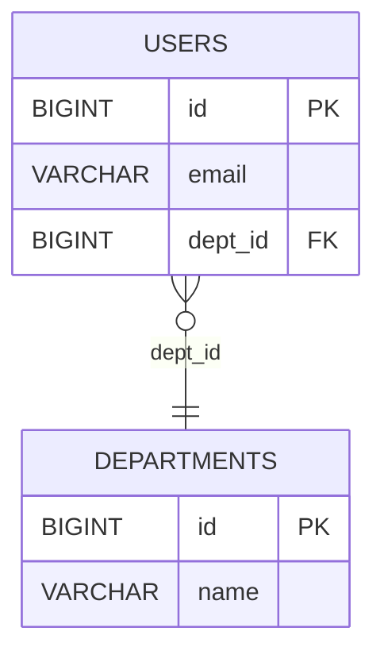

# Codemap — 코드베이스 분석 및 기술 문서 자동 생성 CLI

## 개요

코드베이스를 정적 분석하여 구조화된 데이터를 추출하고, 이를 기반으로 테이블 정의서, ERD, 시퀀스 다이어그램, 아키텍처 다이어그램 등 기술 문서를 자동 생성하는 CLI 도구. Claude Code 스킬로 연동하여 AI 에이전트가 프로젝트 컨텍스트를 로드하고 문서를 자동 생성할 수 있다.

## 배경

- 대상 환경: 10~50명 규모 소프트웨어 개발팀
- 기술 스택: React + Spring Boot 백엔드, Python 모듈/Shell 스크립트/GDAL 등 외부 도구 호출
- DB 스키마는 `doc/database/` 아래 DDL/DML SQL 파일로 관리
- 산출물 용도: 사내 기술 문서(레포 내 마크다운) + 고객/상위 보고용(PDF, Word, Excel)

## 아키텍처

### 파이프라인 구조

역할별로 분리된 서브커맨드가 JSON으로 데이터를 주고받는 파이프라인 방식.

```
코드베이스 ──→ [scan] ──→ codemap.json ──→ [render] ──→ .mmd / .drawio
     │                        │
     │                        ├──→ [doc] ──→ .md (테이블 정의서 등)
     │                        │
     │                        └──→ [export] ──→ .pdf / .docx / .xlsx
     │
     └── doc/database/*.sql (DDL/DML)
```

### 설계 결정 근거

- **파이프라인 구조 선택**: 모놀리식, 라이브러리+CLI 래퍼 방식과 비교. scan 한 번이면 여러 산출물을 반복 생성 가능하고, 에이전트가 중간 JSON을 직접 해석할 수 있어 선택.
- **Python 선택**: TypeScript, Go와 비교. SQL 파싱(sqlglot), Java AST 분석(tree-sitter), 문서 내보내기(weasyprint, python-docx, openpyxl) 생태계가 가장 성숙. 팀에서 이미 Python 사용 중.

### Claude Code 스킬 연동 흐름

```
사용자: "이 프로젝트 아키텍처 문서 만들어줘"
    ↓
에이전트 → codemap scan ./project (JSON 획득)
    ↓
에이전트 → JSON 분석, 유스케이스 식별
    ↓
에이전트 → codemap render erd / sequence / architecture
    ↓
에이전트 → codemap doc generate / codemap export pdf
    ↓
사용자에게 결과 전달
```

## CLI 명령어

```bash
codemap scan <path> [--target db|api|deps|frontend|all] [-o output.json] [--verbose]
codemap render <erd|sequence|architecture|component|all> --from <json> --format <mermaid|drawio> [-o output]
  # sequence 전용 옵션: [--entries "Class.method,..."] [--label "유스케이스명"]
codemap doc <table-spec|api-spec|overview|all> --from <json> [-o output]
codemap export <pdf|docx|xlsx> --from <json|docs/> [-o output] [--template corporate|minimal] [--type table-spec|api-spec]
  # xlsx: scan JSON에서 직접 구조화 데이터로 변환 (--from은 scan JSON 파일, --type 필수)
  # pdf/docx: 마크다운 문서 디렉토리 또는 scan JSON 모두 가능
codemap generate <path> -o <output/> [--target db|api|deps|frontend|all] [--format mermaid|drawio|all] [--export pdf|docx|xlsx|all]
  # 전체 파이프라인 한번에 실행: scan → render all → doc all → export
```

## 상세 설계

### 1. `scan` — 코드베이스 분석

코드베이스를 정적 분석하여 구조화된 JSON 데이터를 생성한다.

#### `--target` 옵션 동작

| 값 | 동작 |
|----|------|
| `db` | DDL/DML 파일만 파싱. JSON에 `database` 키만 채워지고 나머지는 빈 객체 |
| `api` | Spring Controller/Service만 분석. `api` + `dependencies` 키 채움 |
| `deps` | 모듈 간 의존성 + 외부 호출만 분석. `dependencies` 키 채움 |
| `frontend` | React 컴포넌트/API 호출만 분석. `frontend` 키 채움 |
| `all` (기본값) | 전체 스캔. 모든 키 채움 |

`--target` 지정 시 해당 영역만 스캔하고, 나머지 top-level 키는 빈 객체(`{}`)로 출력한다. 여러 타겟을 지정할 수 있다: `--target db,api`

#### 스캔 대상별 분석 방식

| 대상 | 소스 | 파싱 방식 |
|------|------|----------|
| DB 스키마 | `doc/database/*.sql` (DDL) | sqlglot으로 파싱 → 테이블, 컬럼, FK, 인덱스 추출 |
| API 엔드포인트 | Spring Controller (`@RestController`, `@RequestMapping`) | tree-sitter-java로 AST 분석 |
| 서비스 호출 관계 | Spring Service → Service, Repository 호출 | tree-sitter-java로 의존성 주입/메서드 호출 추적 |
| 외부 호출 | `ProcessBuilder`, `Runtime.exec`, Python subprocess | 문자열 패턴 + AST 분석으로 Shell/Python/GDAL 호출 탐지 |
| 프론트엔드 구조 | React 컴포넌트, API 호출 (axios/fetch) | tree-sitter-typescript로 컴포넌트 트리 + API 호출 추출 |

#### 출력 JSON 구조

```json
{
  "version": "1.0",
  "project": "my-project",
  "scannedAt": "2026-03-17T...",
  "database": {
    "tables": [
      {
        "name": "users",
        "columns": [
          { "name": "id", "type": "BIGINT", "pk": true },
          { "name": "email", "type": "VARCHAR(255)", "nullable": false }
        ],
        "foreignKeys": [
          { "column": "dept_id", "references": "departments.id" }
        ],
        "indexes": []
      }
    ]
  },
  "api": {
    "endpoints": [
      {
        "method": "POST",
        "path": "/api/users",
        "controller": "UserController",
        "service": "UserService",
        "calls": ["UserRepository.save", "EmailService.send"]
      }
    ]
  },
  "dependencies": {
    "modules": [
      {
        "name": "UserModule",
        "type": "service",
        "file": "src/main/java/com/example/user/UserService.java",
        "dependsOn": ["UserRepository", "EmailService"],
        "layer": "service"
      }
    ],
    "externalCalls": [
      {
        "from": "GdalService.convert",
        "type": "process",
        "command": "gdal_translate ...",
        "file": "src/main/java/com/example/gdal/GdalService.java",
        "line": 42
      }
    ]
  },
  "frontend": {
    "components": [
      {
        "name": "UserList",
        "file": "src/frontend/components/UserList.tsx",
        "children": ["UserCard", "Pagination"],
        "hooks": ["useState", "useEffect"]
      }
    ],
    "apiCalls": [
      {
        "component": "UserList",
        "method": "GET",
        "path": "/api/users",
        "file": "src/frontend/components/UserList.tsx",
        "line": 15
      }
    ]
  }
}
```

### 2. `render` — 다이어그램 생성

scan JSON 데이터를 Mermaid 또는 draw.io 형식의 다이어그램으로 변환한다.

#### 다이어그램 유형

| 다이어그램 | 입력 데이터 | 출력 내용 |
|-----------|-----------|----------|
| **erd** | `database.tables` | 테이블 간 관계도 (PK/FK, 컬럼 타입) |
| **sequence** | `api.endpoints` + `dependencies` | 유스케이스별 호출 흐름 (React → Controller → Service → DB/외부) |
| **architecture** | 전체 JSON | 레이어 구조 (Frontend / Backend / DB / External) + 모듈 배치 |
| **component** | `dependencies.modules` | 모듈 간 의존성 그래프 |

#### ERD Mermaid 출력 예시



#### draw.io 출력

draw.io XML 형식(`.drawio`)으로 생성. 각 테이블/모듈을 노드로, 관계를 엣지로 표현. draw.io에서 열면 바로 편집 가능.

#### 시퀀스 다이어그램과 에이전트 역할

CLI 단독 실행 시 API 엔드포인트별 호출 흐름을 기계적으로 생성한다. 에이전트가 스킬로 사용할 때는:

1. `codemap scan` 결과 JSON을 에이전트가 읽음
2. 에이전트가 관련 엔드포인트들을 묶어 유스케이스 식별
3. 식별된 유스케이스를 `--entries` 옵션으로 전달

```bash
codemap render sequence --from codemap.json \
  --entries "FileController.upload,GdalService.convert,FileRepository.save" \
  --label "파일 업로드 및 변환" \
  --format mermaid
```

### 3. `doc` — 마크다운 문서 생성

#### 문서 유형

| 문서 | 내용 | 포함 요소 |
|------|------|----------|
| **table-spec** | 테이블 정의서 | 테이블별 컬럼명, 타입, PK/FK, nullable, 인덱스, 비고 |
| **api-spec** | API 명세서 | 엔드포인트 목록, HTTP 메서드, 경로, 호출하는 서비스, 요청/응답 구조 |
| **overview** | 프로젝트 개요 | 기술 스택, 모듈 구성, 레이어 구조, 외부 의존성 요약 |
| **all** | 전체 보고서 | 위 전부 + 생성된 다이어그램 인라인 포함 |

#### table-spec 출력 예시

```markdown
## users

| 컬럼명 | 타입 | PK | FK | Nullable | 설명 |
|--------|------|----|----|----------|------|
| id | BIGINT | O | | N | |
| email | VARCHAR(255) | | | N | |
| dept_id | BIGINT | | departments.id | Y | |

### 인덱스
- idx_users_email : email (UNIQUE)
```

### 4. `export` — 최종 산출물 내보내기

#### 지원 포맷

| 포맷 | 대상 | 변환 방식 | 라이브러리 |
|------|------|----------|-----------|
| **PDF** | 전체 문서 | 마크다운 → HTML → PDF | markdown + weasyprint |
| **Word** | 전체 문서 | 마크다운 → docx | python-docx |
| **Excel** | 테이블 정의서, API 명세서 | 구조화된 데이터 → xlsx | openpyxl |

#### 입력 소스 규칙

| 포맷 | `--from` 입력 | 설명 |
|------|--------------|------|
| **PDF** | 마크다운 디렉토리 또는 scan JSON | 마크다운이면 HTML 변환 후 PDF, JSON이면 doc → PDF 자동 체이닝 |
| **Word** | 마크다운 디렉토리 또는 scan JSON | PDF와 동일 |
| **Excel** | **scan JSON 파일** | 구조화된 데이터에서 직접 xlsx 생성. 마크다운 입력 불가 |

```bash
# Excel은 항상 scan JSON에서 직접 생성
codemap export xlsx --from .codemap/scan.json --type table-spec -o table-spec.xlsx
codemap export xlsx --from .codemap/scan.json --type api-spec -o api-spec.xlsx

# PDF/Word는 마크다운 디렉토리 또는 JSON 모두 가능
codemap export pdf --from docs/ -o report.pdf
codemap export pdf --from .codemap/scan.json -o report.pdf  # 내부적으로 doc → pdf 체이닝
```

#### 엑셀 출력 구조

**테이블 정의서 (table-spec.xlsx):**
- [목차] 시트: 테이블 목록, 컬럼 수, FK 관계 요약
- [테이블명] 시트: 컬럼별 No, 컬럼명, 타입, PK, FK, Nullable, 인덱스, 설명

**API 명세서 (api-spec.xlsx):**
- [엔드포인트 목록] 시트: 전체 API 목록
- [상세] 시트: 엔드포인트별 상세 정보

#### 템플릿 지원

```bash
codemap export pdf --template corporate    # 회사 로고, 헤더/푸터, 표지 포함
codemap export pdf --template minimal      # 깔끔한 기본 스타일
```

- 템플릿 위치: 프로젝트 내 `.codemap/templates/` → `~/.codemap/templates/` 순으로 탐색 (프로젝트 설정이 우선)
- CSS(PDF용) / docx 템플릿 파일로 커스터마이징

### 5. `generate` — 전체 파이프라인 실행

scan → render → doc → export를 한번에 실행하는 편의 명령.

```bash
codemap generate ./project -o output/ --format all --export all
```

#### 기본 동작

1. `scan ./project -o output/.codemap/scan.json` (전체 스캔)
2. `render all --from scan.json --format mermaid -o output/diagrams/` (기본 Mermaid)
3. `doc all --from scan.json -o output/docs/`
4. `export pdf --from output/docs/ -o output/report.pdf`

`--format`으로 다이어그램 포맷 선택, `--export`로 내보내기 포맷 선택. 생략 시 Mermaid + PDF가 기본값.

## 에러 핸들링

### 원칙: 가능한 만큼 처리하고, 실패한 부분은 경고

| 상황 | 동작 |
|------|------|
| SQL 파일에 문법 오류 | 해당 파일 건너뛰고 경고 출력, 나머지 파일 계속 처리 |
| tree-sitter 파싱 실패 (지원하지 않는 문법 등) | 해당 파일 건너뛰고 경고, 파싱 가능한 파일만 결과에 포함 |
| 프로젝트에 특정 영역 없음 (DB 없음, 프론트 없음 등) | 해당 JSON 키를 빈 객체로 출력, 에러 아님 |
| weasyprint 시스템 의존성 미설치 | PDF export 시 명확한 에러 메시지 + 설치 가이드 안내 |
| scan JSON 버전 불일치 | 경고 출력 후 가능한 범위에서 처리. 호환 불가 시 재스캔 안내 |
| 설정 파일 없음 | 기본값으로 동작 (config.yaml은 선택사항) |

### JSON 스키마 버전 관리

- `version` 필드로 스키마 버전 추적
- 마이너 버전 변경(1.0 → 1.1): 하위 호환, 새 필드 추가만
- 메이저 버전 변경(1.x → 2.0): 호환 불가, 재스캔 필요. 명확한 에러 메시지 출력

### 선택적 의존성

weasyprint 등 시스템 의존성이 무거운 라이브러리는 선택 설치로 분리:

```bash
pip install codemap              # 기본 (scan, render, doc, xlsx export)
pip install codemap[pdf]         # + PDF export (weasyprint)
pip install codemap[docx]        # + Word export (python-docx)
pip install codemap[all]         # 전체
```

설치하지 않은 기능 사용 시 `pip install codemap[pdf]` 설치 안내 메시지 출력.

### CLI 공통 옵션

```bash
--verbose / -v    상세 로그 출력 (파일별 처리 상태, 경고 상세)
--quiet / -q      경고 숨기고 결과만 출력
--debug           디버그 로그 (AST 덤프, 파싱 상세)
```

## 프로젝트 구조

```
codemap/
├── pyproject.toml
├── src/
│   └── codemap/
│       ├── __init__.py
│       ├── cli.py                  # Click 기반 CLI 엔트리포인트
│       ├── scanner/
│       │   ├── __init__.py
│       │   ├── sql_scanner.py      # DDL 파싱 (sqlglot)
│       │   ├── java_scanner.py     # Spring Controller/Service 파싱 (tree-sitter)
│       │   ├── ts_scanner.py       # React 컴포넌트/API 호출 파싱 (tree-sitter)
│       │   ├── external_scanner.py # Shell/Python/GDAL 외부 호출 탐지
│       │   └── aggregator.py       # 스캐너 결과를 통합 JSON으로 병합
│       ├── renderer/
│       │   ├── __init__.py
│       │   ├── mermaid.py          # Mermaid 포맷 생성
│       │   └── drawio.py           # draw.io XML 생성
│       ├── doc/
│       │   ├── __init__.py
│       │   ├── table_spec.py       # 테이블 정의서 마크다운 생성
│       │   ├── api_spec.py         # API 명세서 마크다운 생성
│       │   └── overview.py         # 프로젝트 개요 마크다운 생성
│       ├── export/
│       │   ├── __init__.py
│       │   ├── pdf.py              # weasyprint
│       │   ├── docx.py             # python-docx
│       │   └── xlsx.py             # openpyxl
│       └── config.py               # 설정 파일 로드
├── tests/
│   ├── scanner/
│   ├── renderer/
│   ├── doc/
│   └── export/
└── .codemap/
    └── templates/
```

## 설정 파일

설정 파일 탐색 순서: 프로젝트 내 `.codemap/config.yaml` → `~/.codemap/config.yaml`. 프로젝트 설정이 글로벌 설정을 오버라이드한다. 설정 파일이 없으면 기본값으로 동작.

`.codemap/config.yaml`:

```yaml
project:
  name: "my-project"
  description: "프로젝트 설명"

scan:
  database:
    paths: ["doc/database/**/*.sql"]
  backend:
    paths: ["src/main/java/**/*.java"]
    framework: spring
  frontend:
    paths: ["src/frontend/**/*.{ts,tsx}"]
    framework: react
  external:
    patterns:
      - type: process
        keywords: ["ProcessBuilder", "Runtime.exec"]
      - type: python
        keywords: ["python", "python3"]
      - type: gdal
        keywords: ["gdal_translate", "ogr2ogr"]

export:
  template: "corporate"
  logo: ".codemap/templates/logo.png"
```

## Claude Code 스킬

스킬 파일: `~/.claude/skills/codemap.md`

### 스킬 파일 내용

```markdown
---
name: codemap
description: 코드베이스를 분석하여 테이블 정의서, ERD, 시퀀스 다이어그램,
             아키텍처 다이어그램 등 기술 문서를 자동 생성
---

## 사용 가능한 명령어

- `codemap scan <path> [--target db|api|deps|frontend|all] [-o output.json]`
- `codemap render <erd|sequence|architecture|component|all> --from <json> --format <mermaid|drawio>`
  - sequence 전용: `--entries "Class.method,..." --label "유스케이스명"`
- `codemap doc <table-spec|api-spec|overview|all> --from <json> [-o output]`
- `codemap export <pdf|docx|xlsx> --from <json|docs/> [-o output]`
  - xlsx는 반드시 scan JSON을 입력으로 사용: `--from scan.json --type table-spec|api-spec`
- `codemap generate <path> -o <output/> [--format all] [--export all]`

## 에이전트 워크플로우

1. `codemap scan` 실행하여 프로젝트 분석 데이터 획득
2. JSON 결과를 읽고 프로젝트 구조 파악
3. 사용자 요청에 따라 적절한 다이어그램/문서 유형 판단
4. 시퀀스 다이어그램: JSON에서 관련 API 엔드포인트와 호출 체인을 분석하여
   유스케이스 단위로 묶고 `--entries` 옵션으로 전달
5. 생성된 산출물을 사용자에게 안내

## 주의사항

- scan 결과 JSON은 `.codemap/scan.json`에 캐싱하여 재사용 가능
- xlsx export는 마크다운이 아닌 scan JSON에서 직접 생성
- weasyprint 미설치 시 PDF export 불가 — 사용자에게 설치 안내
```

### 에이전트 워크플로우

1. `codemap scan` 실행하여 프로젝트 분석 데이터 획득
2. JSON 결과를 읽고 프로젝트 구조 파악
3. 사용자 요청에 따라 적절한 다이어그램/문서 유형 판단
4. 시퀀스 다이어그램의 경우 에이전트가 JSON에서 유스케이스를 식별하여 `--entries` 옵션으로 전달
5. 생성된 산출물을 사용자에게 안내

### 사용 시나리오

**전체 문서 생성:**
```bash
codemap scan ./project -o .codemap/scan.json
codemap render all --from .codemap/scan.json --format mermaid -o docs/diagrams/
codemap doc all --from .codemap/scan.json -o docs/
codemap export pdf --from docs/ -o docs/report.pdf
```

**특정 유스케이스 시퀀스 다이어그램:**
```bash
codemap scan ./project -o .codemap/scan.json
# 에이전트가 JSON 분석 후 관련 엔드포인트 식별
codemap render sequence --from .codemap/scan.json \
  --entries "FileController.upload,GdalService.convert,FileRepository.save" \
  --label "파일 업로드 및 변환" --format mermaid
```

**테이블 정의서 엑셀:**
```bash
codemap scan ./project --target db -o .codemap/scan.json
codemap export xlsx --from .codemap/scan.json --type table-spec -o docs/table-spec.xlsx
```

## 핵심 의존성

| 라이브러리 | 용도 |
|-----------|------|
| click | CLI 프레임워크 |
| sqlglot | SQL DDL 파싱 |
| tree-sitter + tree-sitter-java | Java/Spring 코드 분석 |
| tree-sitter-typescript | React/TypeScript 코드 분석 |
| weasyprint | PDF 내보내기 |
| python-docx | Word 내보내기 |
| openpyxl | Excel 내보내기 |
| pyyaml | 설정 파일 파싱 |
